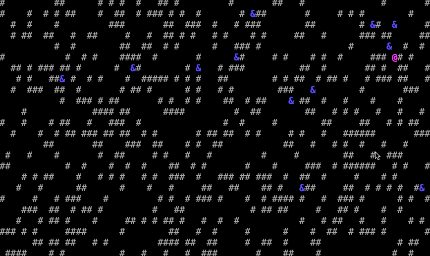

# Seek And Hide in Term

## About
Simple terminal-based roguelike game.

<p float="up">
  
  
</p>

## Build

```
./gradlew build
```

## Docs

```
./gradlew javadoc
```

## Run

```
./gradlew run
```

## Control the app

-  `h,j,k,l` : movement;
- `<shift+h>`: show/hide Help Message;
- `<shift+r>`: regenerate game map;
- `<shift+s>`: save current game state;
- `<shift+l>`: load previously saved game state (if present);


